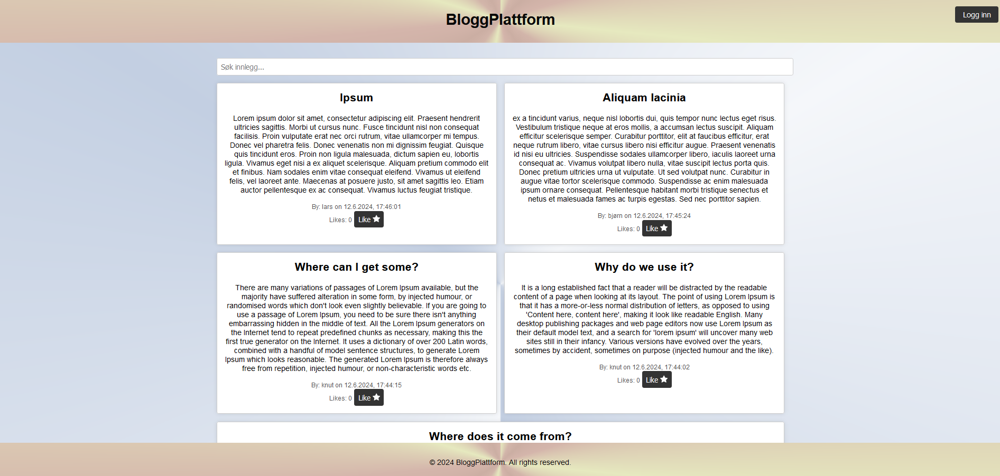
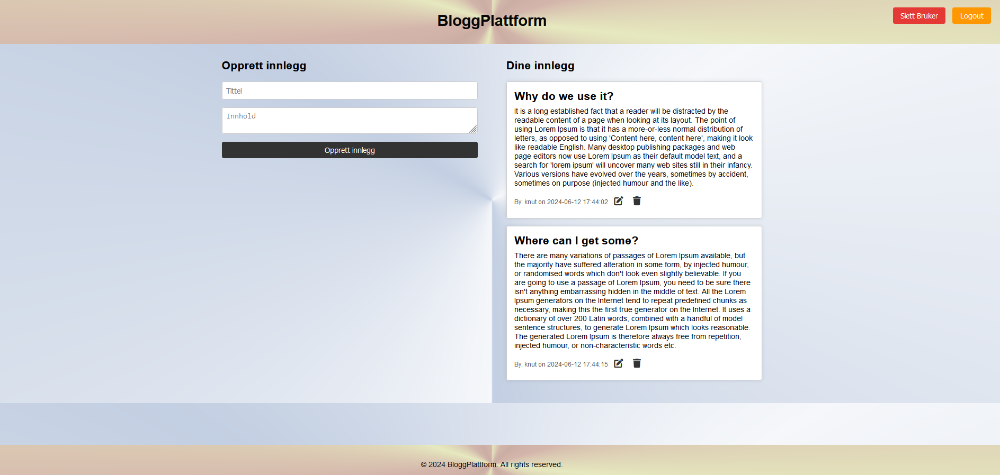

# Project Documentation

## Table of Contents

- [Introduction](#introduction)
- [Installation](#installation)
- [User Management](#user-management)
- [Blog Posts](#blog-posts)
- [Server Configuration](#server-configuration)
- [Database](#database)
- [Postman Testing](#postman-testing)
- [App Architecture](#app-architecture)

## Introduction

This project is a simple blogging platform developed with Node.js and Express, using SQLite as the database. It is a platform where users can register, log in, and create, retrieve, update, and delete blog posts. The goal is to connect the backend to the frontend.

### For more information on `Node`, visit [Node.js](https://nodejs.org/)

### For details on `Express`, visit [Express.js](https://expressjs.com/)

### For details on `SQLite3`, visit [SQLite3](https://www.sqlite.org/docs.html)

## Installation

To install and start the project, follow these steps:

### Step 1: `npm install`

Run this command to install the necessary dependencies.

### Step 2: `npm start`
 - node server.js 

Starts the Express server.

## User Management

### Registration and Login

Implemented with `userRoute.js`. Users can register with a username, email, and password. Passwords are hashed using `bcrypt` before being stored in the database to ensure user data security.

### JWT-based Authentication

Upon login, a JWT (JSON Web Token) is generated and used for authentication in protected routes.

## Blog Posts

### Create Posts

Authenticated users can create blog posts. Each post is linked to the user who created it.

### Read Posts

All visitors to the site can read posts. Posts can be retrieved both individually by ID and as a list of all available posts.

### Update and Delete Posts

The author of a post, identified through JWT, can update or delete their own posts.

## Server Configuration

### Express.js

Used as the backend framework to handle HTTP requests and route them to the corresponding controllers.

### CORS Configuration

Allows the frontend application to safely communicate with the backend. Configured to use `localhost:5500` as the host.

## Database

The application uses an SQLite database to store and manage data. There are two main tables:

### Users

- `users`: Stores user information. Fields include:
  - `id`: Unique identifier for the user.
  - `username`: Username, unique for each user.
  - `password`: Hashed password for secure storage.
  - `email`: User's email address, also unique.
  - `dateCreated`: Date and time when the user account was created.

### Posts

- `posts`: Stores information about blog posts. Fields include:
  - `id`: Unique identifier for the post.
  - `userId`: Reference to the user who created the post.
  - `title`: Title of the blog post.
  - `content`: Content of the blog post.
  - `datePosted`: Date and time when the post was posted.

## Screenshots






## Postman Testing

To test API endpoints via Postman, you can use the following table as a reference. For endpoints that require authentication, a valid JWT token must be included in the `Authorization` header of the HTTP request. The format should be: `Authorization: Bearer [Your token]`.

| Endpoint        | Method | Description                      | Requires Authentication |
|-----------------|--------|----------------------------------|-------------------------|
| `/register`     | POST   | Registers a new user             | No                      |
| `/login`        | POST   | Logs in a user                   | No                      |
| `/posts`        | GET    | Retrieves all posts              | No                      |
| `/posts/:id`    | GET    | Retrieves a specific post        | No                      |
| `/posts`        | POST   | Creates a new post               | Yes                     |
| `/posts/:id`    | PUT    | Updates a post                   | Yes                     |
| `/posts/:id`    | DELETE | Deletes a post                   | Yes                     |

### Example of Testing Endpoints in Postman

1. **Register a new user (`/register`)**
   - Method: POST
   - URL: `http://localhost:3000/register`
   - Body:
     ```json
     {
       "username": "newuser",
       "password": "password123",
       "email": "newuser@example.com"
     }
     ```

2. **Log in a user (`/login`)**
   - Method: POST
   - URL: `http://localhost:3000/login`
   - Body:
     ```json
     {
       "username": "newuser",
       "password": "password123"
     }
     ```

3. **Retrieve all posts (`/posts`)**
   - Method: GET
   - URL: `http://localhost:3000/posts`

4. **Create a new post (`/posts`)**
   - Method: POST
   - URL: `http://localhost:3000/posts`
   - Header: `Authorization: Bearer YOUR_TOKEN_HERE`
   - Body:
     ```json
     {
       "title": "My First Post",
       "content": "Content of the first post"
     }
     ```

## App Architecture

### Overview

This project follows a typical web application architecture with a clear separation between frontend (client) and backend (server).

### Backend

- **Technology**: Built with Node.js and Express.js.
  
- **Key Features**:
  - **API Endpoints**: Handles user requests for authentication, blog post management, and data retrieval.
  - **Database Communication**: Connects to and manages data in the SQLite database.
  - **Security**: Implements JWT for authentication and bcrypt for password hashing.

- **Structure**:
  - **Routes**: Defines API endpoints and links them to corresponding logic.
  - **Middleware**: Handles authentication and error handling.

### Frontend

- The frontend part of the application is developed separately and is responsible for presenting the user interface and handling user interactions.
- **Communication with Backend**: The frontend communicates with the backend through defined API endpoints, sending requests and receiving response data.

### Performance and Scalability

- **Efficient Database Usage**: By using SQLite and optimized queries, database access is handled efficiently.
- **Potential for Scalability**: The code is structured in a way that allows for easy expansion and scalability.
